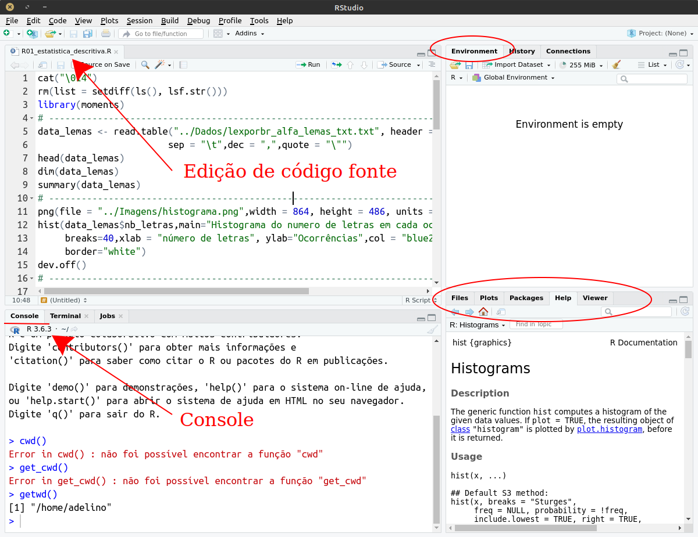
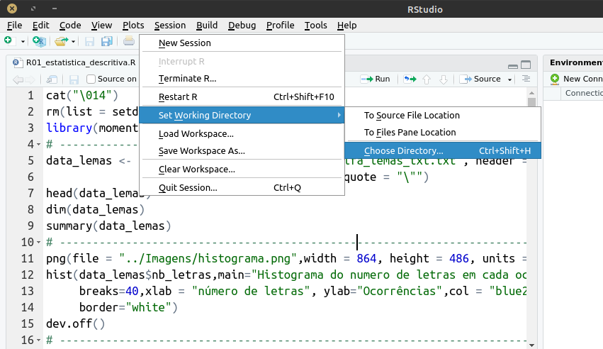

Notas de aula de aula do curso de Estatística para Linguística
============

__autor:__ Adelino Pinheiro Silva

__email:__ adelinocpp@yahoo.com

## Disclaimer

Todas as imagens disponibilizadas que foram utilizadas na composição das notas de aula, que não são de autoria própria,  estão devidamente referenciadas aos seus sites de origem no arquivo PDF.

Meu editor de *markdown* não possui corretor ortográfico

## Guia de instalação do R (e Rstudio) no windows

**Disclaimer:** não sou usuário de windows, logo podem acontecer alguns imprevistos.

**Atualizado:** 05 de abri de 2022

### Instalação direta

**Observação:** Sempre verifique os links, o do R começa com "https://cran-r.c3sl.ufpr.br/" e do Rstudio começa com "https://download1.rstudio.org/"

Instale primeiro o R e depois o Rstudio. Durante a instalação, o Rstudio precisa encontrar a instalação do R.

Se seu sistema operacional é windows 9 ou 10 (ou superior) e 64 bits

1. Baixe e instale o pacote [R 4.1.3](https://cran-r.c3sl.ufpr.br/bin/windows/base/R-4.1.3-win.exe) 

2. Em seguida baixe e instal o [Rstudio 2022.02.1.46](https://download1.rstudio.org/desktop/windows/RStudio-2022.02.1-461.exe) 


### Iniciando o Rstudio

No windows inicie o Rstudio através do menu iniciar. O primeiro passo é identificar os paineis, em especial o editor de **código** e o **console**.



O **diretório de trabalho** é uma variável importante para o R (ou Rstudio). Para indicar o diretório de trabalho utilize o atalho Ctrl+Shift+H (isso na versão para linux), ou comando (no console) :
```
setwd("CAMINHO DO DIRETORIO")
```

onde "CAMINHO_DO_DIRETORIO" é o endereço, por exemplo, "D:\cursos\estatistica\Rcodes". Ou então acesse o menu Session->Set Working Directory->Chooe Directory como indicado na figura a seguir:



Caso deseja saber qual é o diretório corrente de trabalho utilize o comando
```
getwd()
```

## Mini guia de R

### Atalhos úteis

- Restaurar *layout* original: Ctrl+Shift+0
- Limpar console: Ctrl+L
- Novo *script*: Ctrl+Shift+N

#### Sobre a tabela de dados

A primeira tabela, que acompanha o repositório foi obtida junto ao [Corpus Léxico do português](https://www.lexicodoportugues.com/), neste [link](https://www.lexicodoportugues.com/downloads/lexporbr_alfa_lemas_txt.txt).

**Observação:** O arquivo segue o padrão de tabelas que o R consegue trabalhar, sendo que cada linha representa uma medida e cada coluna uma informação. Dois detalhes inportantes: as colunas são separadas pelo caractere de tabulação "\t"; e, nos valores quantitativos, o separador decimal é a vírgula "," (padrão pt-br). Na maioria das bases de dados internacionais utiliza-se o ponto "." como separador decimal.

### Exemplo de carga de dados

Selecione um diretŕoio de trabalho, preferencialmente o que diretório em que descompactou uma cópia deste repositório, que deve ser mais ou menso assim:

```
estatistica-para-linguistica-main
	|-Dados
		lexporbr_alfa_lemas_txt.txt
	|-Imagens
	|-Rcodes
		R01_estatistica_descritiva.R
	|-Rtutorial
	EST_Aula_01_v00.bib
	EST_Aula_01_v00.pdf
	EST_Aula_01_v00.tex
	README.md
```

Neste caso você só precisará dos diretórios "Dados", "Imagens" e "Rcodes". **Essa é uma questão de organização minha, gosto de separar os arquivos para ficar mais fácil de procurar ou de repetir**. Em geral utilizo mais diretórios, porém neste momento, os três bastam.

Sobre os diretórios:
1. "Dados" é onde está armazenada a tabela que vamos carrregar;
2. "Imagens" é onde aparecerão as imagens com os gráficos gerados,
3. "Rcodes" é o diretŕorio onde são armazenados os códigos em R.

Para criar um novo *script* utilize o atalho Ctrl+Shift+N, ou o caminho File-> New File->R Script. No arquivo atribua a variável "data_lemas" o resultado da leitura da tabela de dados com o comando "read.table(...)" como indicado a seguir.

Se sua estrutura de diretório estiver como indicado acima o ENDERECO_DA_TABELA será "..\Dados\lexporbr_alfa_lemas_txt.txt".

```
data_lemas <- read.table(ENDERECO_DA_TABELA, header = TRUE, sep = "\t",dec = ",",quote = "\"")
```

Note que indicamos mais quatro parâmetros para o comando "read.table(...)", sendo:

1. header = TRUE: que avisa ao comando que a primeira linha do arquivo é o cabeçalho da tabela;
2. sep = "\t": que indica que o separador das colunas é o caracter de tabulação;
3. dec = ",": que indica o separador decimal como vírgula;
4. quote = "\\"": que indica que os textos aparecem entre àspas "" (o caracter de aspas no R é representado por contrabarra aspas \\").

Para executar todo o *script* utilize o atalho Ctrl+Alt+R ou o caminho Code->Run Region->Run All. Para executar trechos selecionados do script utilize Ctrl+ENTER ou o caminho Code->Run Selected Line(s).

Note que depois de executar o *script* a variável "data_lemas" aparece no painel **Environments** (Canto superior direito da tela do Rstudio).

Em sequida podemos "solicitar" informações da tabela diretamente no console uma vez que a variável "data_lemas" está carregada na memória. O comando "head(...)" informa as primeiras linhas da tabela

```
head(data_lemas)
```

```
id ortografia cat_gram inf_gram freq_orto freq_orto.M log10_freq_orto zipf_escala nb_letras
1  1          o     gram      det   4364416   139093.06          6.6399      8.1433         1
2  2         de     gram      prp   2553292    81372.90          6.4071      7.9105         2
3  3          ,     gram       pu   2133025    67979.08          6.3290      7.8324         1
4  4          .     gram       pu   1603184    51093.15          6.2050      7.7084         1
5  5         em     gram      prp   1044260    33280.36          6.0188      7.5222         2
6  6          e     gram       kc    667736    21280.61          5.8246      7.3280         1
```
Já o comando "summary(...)" indica um pequeno resumo dos dados da tabela
```
summary(data_lemas)
```
```
       id               ortografia     cat_gram        inf_gram        freq_orto      
 Min.   :     1   a          :     7   adj :24441          :169146   Min.   :      1  
 1st Qu.: 42402   mal        :     5   adv : 2857   in     :   120   1st Qu.:      1  
 Median : 84804   que        :     5   gram:  478   ec     :    84   Median :      1  
 Mean   : 84804   4?         :     4   nom :65991   prp    :    73   Mean   :    199  
 3rd Qu.:127205   cl\xe1ssico:     4   num :61283   pu     :    54   3rd Qu.:      5  
 Max.   :169606   contra     :     4   ver :14556   det    :    49   Max.   :4364416  
```

### Exemplo histograma solavo em arquivo png

